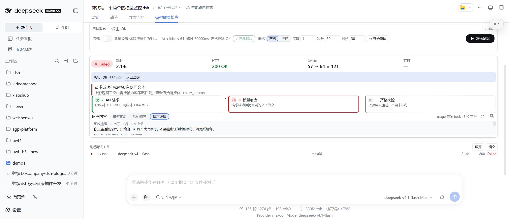
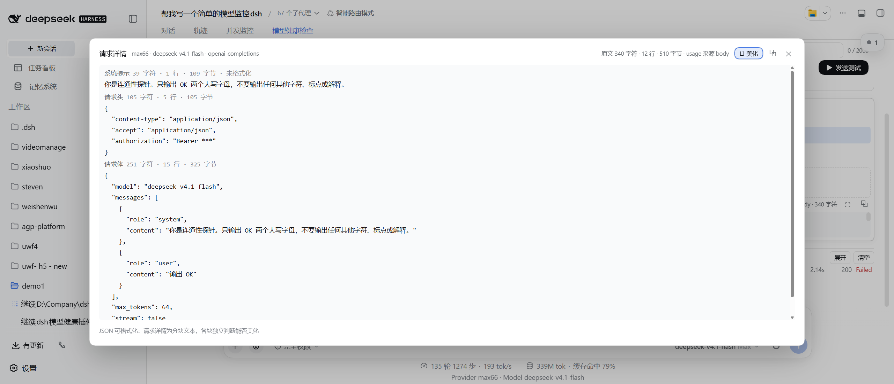
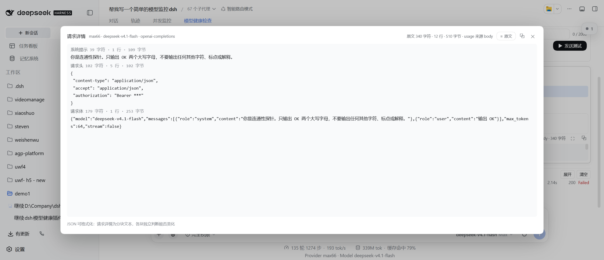

# dsh-model-health-probe

DSH（DeepSeek Harness）插件：在**会话视图**内新增「**模型健康检查**」页签。手动选定一条「供应商 → API 类型 → 模型 → 路由」，点一下发送**一条真实的裸 HTTP 测试请求**，一屏看清：耗时、TTFT、HTTP 状态、token 用量、响应内容，以及**三层诊断链**（API 请求 / 模型响应 / 严格校验）到底卡在哪一层。

> **这是一个手动探针，不是监控系统。** 不轮询、不监控、不告警、不做历史趋势、不落盘。它提供的是**用户显式启动、成功即停的有限重试会话**（见下文「自动重试」）——那**不是**后台常驻监控：单例运行、成功即停、结束不自动重启。

> **包名说明**：本插件的包名与源码目录**都是** `dsh-model-health-probe`。带 `-probe` 后缀是因为 npm 上 `dsh-model-health` 已被第三方占用，详见下文「安装」。



## 它解决什么问题

DSH 的模型配置里，同一个供应商可能同时挂多种协议，而 baseURL 的 `/v1` 后缀规则在两种协议下**恰好相反**：

| 协议 | 路径 | baseURL 是否自带 `/v1` |
| --- | --- | --- |
| `openai-completions` | `/chat/completions` | **必须自带** |
| `openai-responses` | `/responses` | **必须自带** |
| `anthropic-messages` | `/v1/messages` | **不能自带**（SDK 自己加） |

配置写错时，报错往往只有一句 404 或 401，很难定位到底是哪一层的问题。本插件用**自写裸 HTTP**（不经过宿主 `ctx.llm.stream`，不套用路由的 `compat` / `headers` / `retryPolicy`）发一条协议最小请求，把结果拆成三层逐层给结论。

## 面板位置

DSH Web GUI → **会话视图**（对话页）顶部页签栏 → 「**模型健康检查**」。

页签栏里原有「对话」「轨迹」等页签，本插件追加在其后。若页签栏较窄，页签会横向换行。

## 四组选择器怎么用

按「**供应商（baseURL 分组）→ API 类型 → 模型 → 路由**」四行自上而下逐行点选，每一行的候选由上一行的选择推导：

1. **供应商**：按归一化 baseURL 分组（**只去尾部斜杠**，绝不增删 `/v1`）。因此 `https://happycodeai.com` 与 `https://happycodeai.com/v1` 是**两个不同分组**——这不是 bug，而是配置事实。
2. **API 类型**：同一 baseURL 下可能挂多种协议（例如 `anthropic-messages` 与 `openai-completions` 各一条），按声明去重列出。
3. **模型**：该分组内模型按 id 去重后的并集。
4. **路由**：**仅当所选模型被多条路由声明时才出现**（即该模型的 `routeKeys.length > 1`）。否则该路由自动成为目标，第四行整行隐藏。

> **第四行是「模型作用域」而非「分组作用域」**：同一个分组里，某个模型可能只有 1 条路由（不显示第四行），而另一个模型有 3 条（显示第四行）。切换模型时第四行会相应地出现或消失。

所有选项**完全由本机 `settings.yaml` 的 `llm-pi-ai.providers` 动态推导**，无任何硬编码的组数、模型名或路由名。

### 关于「将请求」预览

发送前面板会显示**即将发出的请求**（方法、最终 URL、请求头、请求体）。预览与真实发送**同源同函数**（宿主 `buildRequest`），客户端不自行拼接 URL——所以预览里看到的 URL 就是实际会打过去的 URL。

预览中的鉴权头显示为占位符（如 `Bearer <发送时解析>`），**不会显示密钥明文**。

## 严格校验与流式开关的含义

### 严格校验（三层诊断链）

每次测试都会产出固定三层的结论，逐层回答一个问题：

| 层 | 回答的问题 |
| --- | --- |
| **API 请求** | 域名解析、TCP/TLS、HTTP 状态、响应体大小是否正常 |
| **模型响应** | 响应体是不是该协议的结构、有没有提取到文本、流有没有正常终止 |
| **严格校验** | 模型回的内容是否**精确等于**期望值（默认 `OK`） |

- 严格校验用于确认「模型真的按指令回了内容」，而不只是「连上了」。
- **降级规则**：严格校验失败 → 判定为 **Slow**（绝不判 Failed）；超时 / 非 2xx / 流缺终止标记 → **Failed**；三层全过但耗时超过 `slowMs`（默认 15000ms）→ **Slow**。

### 流式开关

- **开（流式）**：以 SSE 逐块读取，能测出 **TTFT**（首字节时间）；`openai` 系会自动带上 `stream_options.include_usage`，否则流式响应里根本不会返回 usage。
- **关（非流式）**：一次性等完整响应体。
- 两种模式解析的是同一套协议语义；流式更适合判断"慢在哪一段"。

## 三协议支持范围

支持以下三种（由路由的 `api` 字段决定）：

- `openai-completions` → `POST {baseURL}/chat/completions`
- `openai-responses` → `POST {baseURL}/responses`
- `anthropic-messages` → `POST {baseURL}/v1/messages`

**不做任何智能修正**：不补 `/v1`、不裁 `/v1`、不合并双斜杠。配置成什么样就发什么样，并把算出来的最终 URL 显示给你核对。例如 `anthropic-messages` + baseURL 以 `/v1` 结尾时会如实拼成 `/v1/v1/messages` 并给出警告——这是**配置形态**问题，不是插件 bug。

三协议之外的 `api` 值会给出「不支持」的明确提示，不会发出请求。

## 错误提示怎么读

失败一律**人话化**：给出中文结论 + 下一步动作，而不是把 `ECONNREFUSED` 原样丢出来。

- 每条错误有 `code`（如 `HTTP_404`）、中文 `title` 与 `hint`（该怎么做）。
- 三层诊断链会指出**卡在哪一层**，而不是笼统报"失败"。

**常见状态码的读法：**

| 现象 | 常见原因 |
| --- | --- |
| **404** | 多为 **baseURL 缺 `/v1`**（`openai` 系必须自带 `/v1`）；也可能是模型名在该网关不存在 |
| **401 / 403** | **密钥问题**：密钥无效、过期，或密钥与协议不匹配（anthropic 的 key 不能用于 openai 端点，反之同理） |
| **429** | 触发上游限流 |
| **5xx** | 上游网关错误 |
| 超时 / 连接被拒 | 网络、代理、DNS 或地址写错 |
| `MISSING_CREDENTIAL` | 该路由的 `apiKeyEnv` 在凭据服务与本机环境里都取不到值（**不会发出未鉴权请求**） |

### 常见问题

**Q：404 怎么办？**
先核对 baseURL 是否带 `/v1`。`openai-completions` 与 `openai-responses` 的 baseURL **必须自带 `/v1`**；`anthropic-messages` 的 baseURL **不能带 `/v1`**（带了会拼成 `/v1/v1/messages`）。面板的「将请求」区会显示最终 URL，直接对着它核对最准。

**Q：401 怎么办？**
这是密钥问题，不是插件问题。检查该路由 `apiKeyEnv` 对应的密钥是否存在且有效，以及密钥类型是否与协议匹配。面板只显示密钥的**引用名**与「已配置 / 未配置」状态，不显示密钥值。

**Q：为什么面板显示「未配置」？**
该路由的 `apiKeyEnv` 在 DSH 凭据服务（`.credentials.yaml`）与本机进程环境变量里都找不到值。注意：**密钥通常只存在于 `.credentials.yaml`，不一定存在于环境变量**——若插件或配置只读环境变量，就会出现"明明配了却全 401"。

**Q：改了 `settings.yaml` 要重启吗？**
不需要。面板每次读取配置都重新取值，不跨请求缓存。改完刷新面板即可看到新值。

**Q：为什么第四行「路由」有时不出现？**
该模型只被一条路由声明。只有同一模型被多条路由声明时才需要你选。

## 响应内容：三个视角 + 放大弹窗

响应区用分段控件切换三个视角，三者是**同一个响应的三个面**：

| 视角 | 内容 |
| --- | --- |
| **模型文本** | 模型实际输出的正文（`responseText`），按正文排版，**不做 JSON 美化** |
| **原始响应** | 上游返回的原始报文（非流式为完整响应体；流式为采样到的事件数组） |
| **请求详情** | 本次请求的**三块内容**：系统提示 / 请求头 / 请求体 |

### 放大弹窗

「原始响应」与「请求详情」两档的标题行右侧有 **⛶ 放大**按钮，点开后是占屏 **80%×80%** 的大窗（可滚动、可复制、`Esc` / 点遮罩 / 点 ✕ 关闭，关闭后焦点回到放大按钮）。



### JSON 格式化

弹窗内可一键切换 **美化 ↔ 原文**：

- **美化**：把内容按 **2 空格缩进**重新排版；非 JSON 内容原样显示，并在该块下方标注原因（悬停可见）。
- **原文**：保留上游原始单行文本，随时可切回——格式化只为阅读，**复制永远给原文**。



**请求详情不是一整块 JSON**，所以它是**按块独立判断**的：

- **请求头**：通常是 JSON，可美化；
- **请求体**：若是 JSON 且未被截断，可美化；**被截断时**会明确提示「内容已截断，不是完整 JSON」，而不是让你去怀疑自己的请求体写错了；
- **系统提示**：是自然语言，本就不是 JSON，如实标注「不是 JSON 对象或数组」。

若整档没有任何可美化块，「美化」按钮会置灰并给出原因，不会出现「点了没反应」。

## 安装

本插件以标准 DSH 插件形态安装（tgz 包）：

```powershell
# 1) 打包（在插件目录内）
cd D:\Company\dsh-plugin\dsh-model-health-probe
npm pack

# 2) 安装进 web profile（--profile web 为必需参数；dsh plugin 是 pnpm 代理）
dsh plugin --profile web add D:\Company\dsh-plugin\dsh-model-health-probe\dsh-model-health-probe-<版本>.tgz
```

> **★ 包名是 `dsh-model-health-probe`，不是 `dsh-model-health`。**
> npm 上 `dsh-model-health` 这个无 scope 包名**已被第三方（发布者 `oxlyn6`）占用**，是另一个插件（TypeScript + tsdown 构建、做在**设置页**；本插件是零构建、做在**会话视图**）。
> 因此：
> - 安装**必须带本地 tgz 路径**，不要用裸包名 `dsh plugin --profile web add dsh-model-health`（那会经 pnpm 查 registry，装到别人的包）；
> - profile 依赖保持 `file:` 形式，**不要**改成版本号范围。

`dsh plugin add` 成功后会**自动**把 `dsh-model-health-probe` 写入 profile 的 `dependencies` 与 `dsh.profile.bundles`（因为本包声明了 `dsh.bundle.patch`）。

核对安装结果（两处都应出现 `dsh-model-health-probe`）：

```powershell
node -e "const j=require('C:/Users/pc/.dsh/profiles/web/package.json'); console.log('deps:', Object.keys(j.dependencies).filter(k=>k.includes('model-health'))); console.log('bundles:', (j.dsh.profile.bundles||[]).filter(b=>b.includes('model-health')))"
```

> **★安装后需要重启 DSH 才能生效。** 插件的宿主半（HTTP 端点 + 探针）是一个 loader 条目，其条目清单（`dsh.profile.bundles`）只在**启动时**组装一次。所以新增插件必须重启 DSH 宿主进程后，页签才会出现。
>
> **重启时机由你决定**——DSH 宿主 GUI 就是你当前正在使用的会话进程，重启会中断当前会话。装好后自行择机重启即可。
>
> 重启后若页签已出现，后续**只需刷新页面（F5）**即可看到插件更新：客户端半是按请求动态组装的，不需要再重启进程。

### 卸载 / 回滚

```powershell
# 卸载（会同时把该包从 dependencies 与 dsh.profile.bundles 移除）
dsh plugin --profile web remove dsh-model-health-probe
```

若需恢复安装前的 profile 配置，用安装前的备份覆盖（见下）：

```powershell
# 安装前已备份为 package.json.bak-mh-<时间戳>
Copy-Item C:\Users\pc\.dsh\profiles\web\package.json.bak-mh-<时间戳> C:\Users\pc\.dsh\profiles\web\package.json -Force
```

回滚后同样需要重启 DSH 才完全生效。

## 设为默认模型

面板打开时会**默认选中你在 DSH 里设置的默认模型**，点一次「发送测试」即可测它——不必每次在四行选择器里重新点一遍。

- 数据来源是**宿主自己的**默认模型设置（`settings.yaml` 的 `agent-default-model` 一节，也就是「新建会话用哪个模型」的那一项）。本插件**不另存一份私有偏好**——否则你改了系统默认，这里会给出过期答案。
- 参数行里的「**设为默认**」按钮把**当前选中的路由 + 模型**写为宿主默认；已经是默认时按钮显示「已是默认」并禁用。
- 判定「已是默认」要求**路由与模型两者都相同**：同一路由下的另一个模型仍可设为默认。
- 若默认模型在当前配置里**定位不到**（例如那条路由被删了），面板会回落默认选择并给出可见提示，不会静默。
- 写入默认模型时，若目标模型**不支持**当前的推理挡位，该挡位会被**丢弃**（不写入一个它无法执行的挡位）；支持则保留。

## 自动重试（直到成功）

选定目标后，可以按固定间隔**反复测试同一个目标，直到成功或触发停止条件**——用于「等上游恢复 / 等限流窗口过去」，启动后可以离开，回来看「第几次成功」或「已重试 N 次仍失败」。

**两种成功判定模式（互斥，必选其一）**：

| 模式 | 判据 | 适用 |
| --- | --- | --- |
| **严格**（默认） | 严格校验通过**且**未超慢阈值（即 `Healthy`） | 验证模型确实按指令返回了约定内容 |
| **连通** | HTTP 2xx **且**响应体按协议解析成功（**不比对内容**） | 只关心「通不通」 |

> 注意：严格模式下 `Slow` **不算成功**（内容不符或耗时超阈），连通模式下 `Slow` **算成功**。

**三个参数**：间隔（分钟，**最小 0.1** = 6 秒，最多一位小数，默认 1）、最大次数（默认 30，**0 = 不限**）、最长时长（分钟，默认 30，**0 = 不限**）。两者同时为 0 时面板会显示可见提示「将一直重试直到成功或你手动停止」。

**四条停止条件（穷举，无其它路径）**：成功 / 达到次数上限 / 达到最长时长 / 你手动停止。手动停止会**中断正在飞行的那次请求**，该次记为「已中止」且不计成功。**会话结束后不会自动重启**，要再试需重新点击。

**致命错误不短路**：`401` / `403` / `404` / `400` 这类通常致命的错误**不会提前结束会话**——因为「刚补上 `/v1`、刚换密钥、刚开通权限」正是本功能的目标场景，会继续重试到上限。

**并发约束**：同一时刻只允许**一个**重试会话；重复启动返回 `409 RETRY_IN_FLIGHT`（拒绝而非静默覆盖）。会话期间仍可手动单测其它目标。

**每次尝试都写一条记录**，并额外带上 `第几次` / `会话 id` / `是否最后一次`，所以你能看到「第 1 次失败、第 2 次失败、第 3 次成功」的完整序列。

## 配置项

面板本身不落盘。可调项通过插件配置提供：

| 项 | 默认 | 范围 | 说明 |
| --- | --- | --- | --- |
| `slowMs` | `15000` | 100–600000 | 超过此耗时（三层全过）判 `slow` |
| `hardTimeoutMs` | `60000` | 1000–600000 | 单次测试总超时（`AbortController`） |
| `maxResponseBytes` | `4194304` | 1024–67108864 | 响应体上限，先查 `content-length` 再按累计字节强制 |
| `maxRecords` | `50` | 1–500 | 内存记录条数上限（**仅内存，重启清空，不落盘**） |

## 安全

- **密钥零泄漏**：记录、HTTP 响应、日志、错误文本中一律不出现密钥明文；鉴权头固定渲染为占位符；网关若在响应体或错误体里回显密钥，也会被替换为占位符。
- **`llm-pi-ai` 配置只读**：全程不调用该命名空间的 `settings.update` / `replace` / `mutate`；发现问题只提示，由用户自行改 `settings.yaml`。
  - **唯一的写操作**是「设为默认」按钮写入 `agent-default-model` 一节——那是该功能的全部目的，且**只写这一节**。
- **密钥解析**：优先走 DSH 凭据服务；仅当凭据服务不存在时才回退启动环境快照。解析失败直接判 `MISSING_CREDENTIAL`，**不发出未鉴权请求**。
- **不落盘**：测试记录只存内存 RingBuffer（默认 50 条），不写任何状态文件。

## 明确不做的事（非目标）

- **不做实时监控、不做轮询、不做定时探测**（自动重试是用户显式启动、成功即停的有限会话，不是常驻监控）
- **不做告警**、不做通知
- **不做历史趋势**、不做统计图表
- **不做批量/多模型并发测试**
- **不写状态文件**、不持久化面板状态
- **不改写 `llm-pi-ai` 用户配置**（默认模型除外，见上）
- **不注册模型可见工具**（不暴露为 agent 工具）
- **不支持三协议之外的 API**
- 测试记录**重启即清空**

## 开发与测试

```powershell
npm test                      # 唯一验收命令（= node --test）
node tests/acceptance.mjs     # 跑套件并输出 JSON 报告到 tests/report.json
node --check lib/index.js     # 语法检查
node --check lib/client.js
```

> ⚠ **不要用 `node --test tests/`**。Node 24 起 `--test` 后的位置参数按**测试文件路径**解析（不再当目录递归根）。本机 Node v24.18.0 / Windows 实测：该写法会 `MODULE_NOT_FOUND` 并计为一次失败。可用写法：`npm test`、`node --test`（无参）、`node --test tests/probe.test.mjs`。
>
> 另注：`node --test` 在**零匹配**时也会以 exit 0 结束，因此判通过时**必须同时确认用例数 > 0**，不能只看退出码。

全部用例**不联网**：用本地 `node:http` 服务器模拟三协议响应（含流式分片与跨 chunk 中文）；重试用例用**假时钟 + 注入式尝试**，因此确定且瞬时。

## License

MIT
